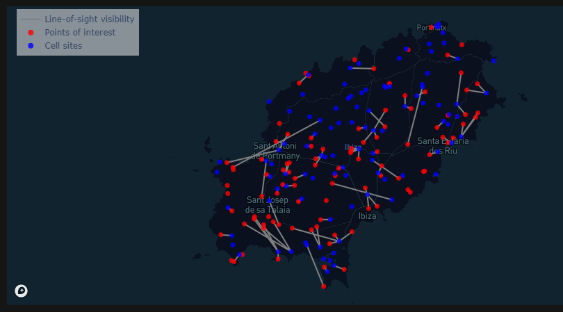

# Input data

In order to use the tool, you need to provide it with your own data. Specifically, you will need to provide the tables described below.

## Point of interest data

This table should include the following columns:

- poi_id: A unique identifier for each row/point of interest (POI)
- lat: the latitude for each point of interest in degrees (WGS84)
- lon: the longitude for each point of interest in degrees (WGS84)

*Example:*

| poi_id | lat | lon |
|--------|-----|-----|
| 23dd6a45-3656-435b-b3b1-c16efab9daeb | 39.00777 | 1.561872 |
| e13a657c-edf0-4013-92db-6c70136e3ac9 | 38.90686 | 1.27542 |
| de75c87b-2676-47be-8454-4c44c4e6f644 | 38.99313 | 1.353725 |
| 4267fc81-0e9f-40ca-84c8-84529958dc22 | 39.00427 | 1.525952 |
| ae0ccc6e-5f91-4a58-a60b-68e8ebcdc797 | 38.95677 | 1.323312 |

## Cell site data

This table should include the following columns:

- ict_id: A unique identifier for each row/cell site
- lat: the latitude for each cell site in degrees (WGS84)
- lon: the longitude for each cell site in degrees (WGS84)
- radio_type: the radio type for each cell site, either 3G, 4G, 5G or missing (NaN)

*Example:*

| ict_id | lat | lon | radio_type |
|--------|-----|-----|------------|
| 300a1494-68dc-4cb7-9825-1b8d98f07c6e | 39.00121 | 1.439019 | 3G |
| e47beab8-2b94-4a0f-ad9d-c434dde76a0c | 38.96746 | 1.228496 | 4G |
| ad9f5591-f2fd-4ec6-a35f-31c4fb8d7013 | 39.00755 | 1.541224 | 4G |
| 86818972-6723-46e5-9916-af01c2be5383 | 38.8705 | 1.384335 | 4G |
| 54f7a596-d5a1-4031-84c5-5d4b61b7cbca | 38.8573 | 1.384546 | 4G |

## Visibility data

You also need to provide data on the visibility status between each point of interest and cell site. Each row in this table is a POI-cell site pair, where there is line-of-sight visibility between the two objects. The visibility table should include the following columns:

- ict_id: A unique identifier for each cell site
- poi_id: A unique identifier for each point of interest
- ground_distance: The ground distance between the cell site and point of interest
- order: ranking of each point of interest and cell site pair according to ground distance, in increasing order (1=closest cell site)

| poi_id | ict_id | ground_distance | order |
|--------|--------|-----------------|-------|
| 23dd6a45-3656-435b-b3b1-c16efab9daeb | f7412e93-8fb4-4abf-a298-8fb0876a97f5 | 1502 | 1 |
| 23dd6a45-3656-435b-b3b1-c16efab9daeb | ad9f5591-f2fd-4ec6-a35f-31c4fb8d7013 | 1784 | 2 |
| 23dd6a45-3656-435b-b3b1-c16efab9daeb | 4ea23bde-9f03-4e96-871d-59276323e1c2 | 2598 | 3 |
| e13a657c-edf0-4013-92db-6c70136e3ac9 | 8a4cfe6a-ce1a-4096-84dc-be09b32b8567 | 4814 | 1 |
| de75c87b-2676-47be-8454-4c44c4e6f644 | 9429f910-1d6b-4e52-8bb4-6f331d21e7ee | 646 | 1 |
| de75c87b-2676-47be-8454-4c44c4e6f644 | 82e53aaa-57c5-4437-898c-3c8d5c2e8336 | 1086 | 2 |
| de75c87b-2676-47be-8454-4c44c4e6f644 | 2fb90cc1-38d3-4aa7-951c-b9a823a63822 | 2346 | 3 |

Here below is an illustration of line-of-sight visibility between pairs of points of interest and cell sites.

