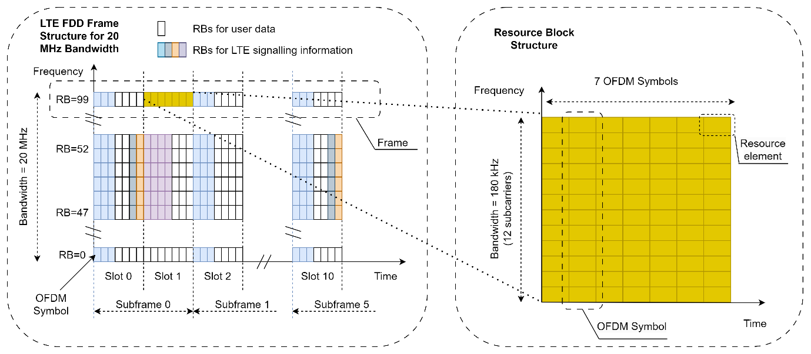
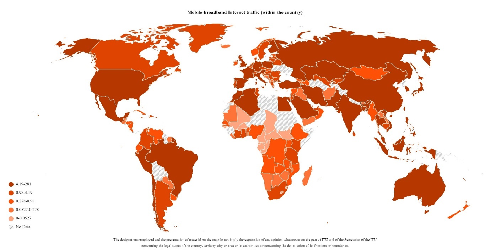
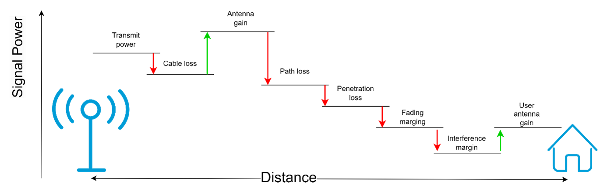
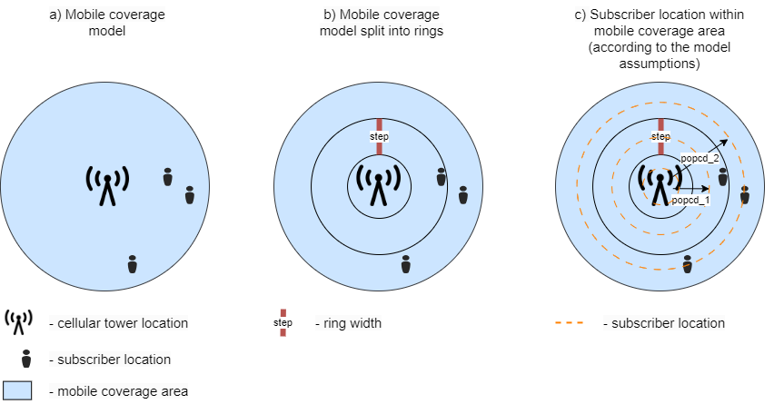
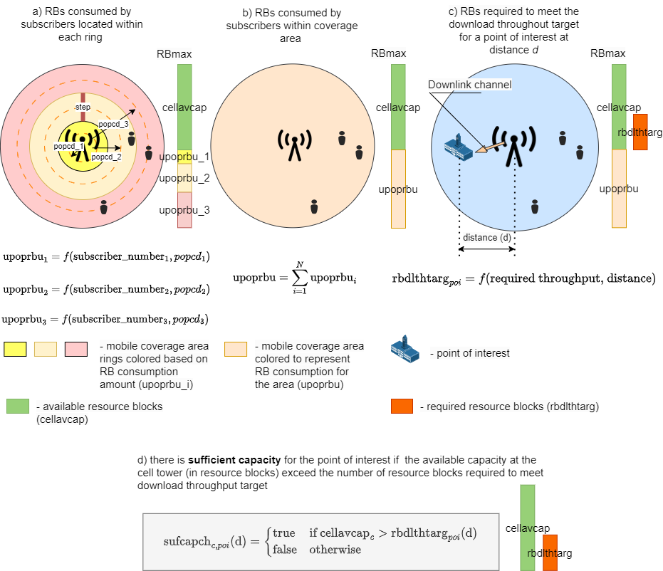

# The Mobile Network Capacity Model

The Mobile Network Capacity Model serves as an instrument designed to assess whether a 4G LTE cellular network's internet connectivity is adequate to enable essential locations such as hospitals, schools, and residential homes - referred to as points of interest (POIs) - to access the internet reliably. To delve into how this tool operates, it's important to understand the intricate structure of the LTE channel and some underlying principles of radiocommunications described below.

The LTE channel is organized in a complex structure that consists of different elements, such as frames, subframes, slots, resource blocks (RBs), and OFDM symbols (Figure 1). These elements are the ways to organize the transmission of data across a radio channel in time and frequency domains. To check if the available throughput is enough to connect a point of interest to the internet, this tool uses RBs as the smallest resource units that can be allocated to a user. Each user within a mobile coverage area utilizes RBs to send data. The more users there are within the coverage area, the more data is being transmitted, and the more RBs are being consumed. That’s why the tool uses population density maps to count the number of users within a coverage area and utilizes ITU statistics (Figure 2) on annual mobile traffic consumption to estimate the average traffic consumption for subscribers living within this coverage area.  

*Figure 1: LTE FDD frame structure for 20MHz bandwidth channel ([source](https://www.sharetechnote.com/html/FrameStructure_DL.html))*

*Figure 2: Mobile-broadband Internet Traffic (within the country), in exabytes per year ([source](https://datahub.itu.int/data/?i=13068))*

The number of RBs utilized by subscribers also depends on the distance from their location to the cell tower; the farther away they are from towers, the more RBs are required to transmit the same amount of data. This is explained by the fact that signal power decreases with distance (Figure 3). This, in turn, decreases the signal to interference and noise ratio (SINR). The lower the SINR, the higher the probability of errors at the receiver side. To reduce the error probability and comply with data transmission standards, user equipment sends channel quality indicator (CQI) information to the base station (Table 1), which is used to choose the modulation and coding scheme (MCS) that defines how many useful bits can be transmitted per Resource Element (RE) and, consequently, per RB, which consists of REs. The better the quality, the higher the MCS, and the more useful data can be transmitted. Conversely, the worse the radio conditions, the lower the MCS, and the less useful data can be transmitted. Therefore, users located far away from the cell tower consume more RBs to transmit the same amount of data: they transmit less data per RB, and more RBs are required to transmit the same amount of data.

*Figure 3: 4G LTE link budget ([source](https://5g-tools.com/4g-lte-link-budget-calculator/))*

*Table 1 - SINR and CQI mapping table in LTE (Source: "Essentials of LTE and LTE-A", Autoren Amitabha Ghosh, Rapeepat Ratasuk).*

| SINR [dB] | CQI code | Modulation | Code Rate |
|-----------|----------|------------|-----------|
| -6.7      | 1        | QPSK       | 0.076     |
| -4.7      | 2        | QPSK       | 0.12      |
| -2.3      | 3        | QPSK       | 0.19      |
| 0.2       | 4        | QPSK       | 0.3       |
| 2.4       | 5        | QPSK       | 0.44      |
| 4.3       | 6        | QPSK       | 0.59      |
| 5.9       | 7        | 16QAM      | 0.37      |
| 8.1       | 8        | 16QAM      | 0.48      |
| 10.3      | 9        | 16QAM      | 0.6       |
| 11.7      | 10       | 64QAM      | 0.45      |
| 14.1      | 11       | 64QAM      | 0.55      |
| 16.3      | 12       | 64QAM      | 0.65      |
| 18.7      | 13       | 64QAM      | 0.75      |
| 21.0      | 14       | 64QAM      | 0.85      |
| 22.7      | 15       | 64QAM      | 0.93      |

Thus, to estimate the average available throughput within the mobile coverage area of a particular cell tower, we need to count the amount of consumed RBs and subtract them from the maximum amount of available RBs. The amount of consumed RBs depends on the subscribers' average traffic consumption and their location within the coverage area (Figure 4a). The model makes several simplifications and assumptions. It assumes that the population is equally distributed across the coverage area because, in most cases, there is no data about the antenna sector directions. It breaks down the coverage area into several rings to count the subscribers living within each ring (Figure 4b), using one distance parameter for each ring (Figure 4c) to define the number of consumed RBs for each ring (Figure 5a). Then the model sums up the RB consumptions and subtracts it from the maximum possible RBs for this cell tower. The resulting value is the amount of available RBs that the model uses to compare with the POI throughput requirements (Figure 5b). If the number of RBs (which is defined by the POI throughput requirement and the distance from the cell tower, Figure 5c) required by the POI is less than the number of available RBs, then the capacity is sufficient to connect the POI to the cell tower; it is insufficient otherwise (Figure 5d).

*Figure 4: Mobile coverage model (subscriber locations)*

*Figure 5: Resource blocks consumption and capacity check*